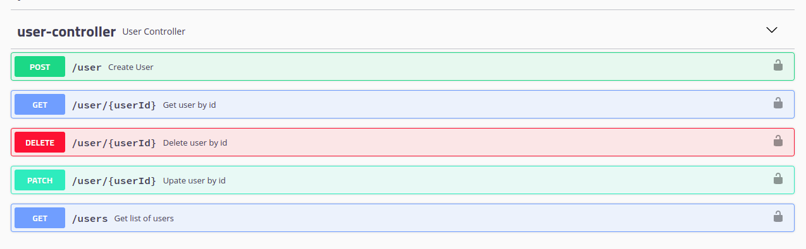
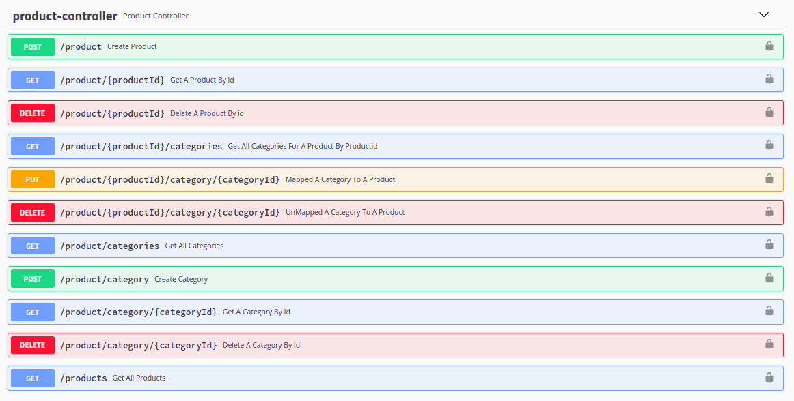
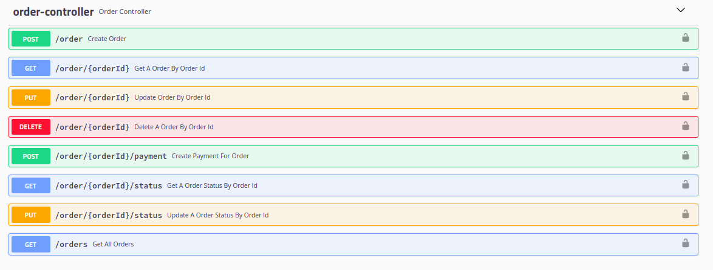
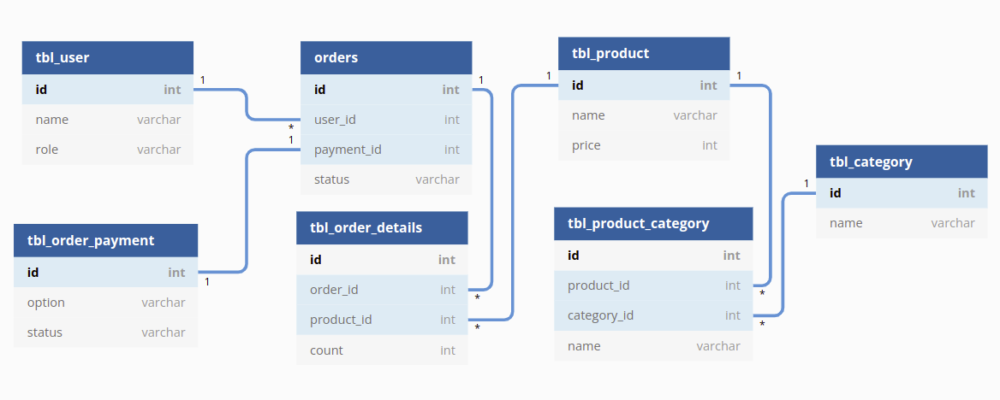

# basic-ecommerce

## Rest api for basic ecommerce actions

<p>List of Tech features  used for this projects are: <p>
<hr>
<ul>
<li>Spring Boot</li>
<li>Spring Boot Data Jpa</li>
<li>H2 in memory DB</li>
<li>Spring Boot Validations</li>
<li>Swagger</li>
<li>Mapstruct</li>
<li>Basic Auth</li>
<li>Method Level Security</li>
<li>Central Exception Handler</li>
<li>Custom Validation Annotation Creations</li>
<li>Custom Method Security Expressions</li>
<li>JUnit Rest Api Test Case with Mockito</li>
</ul>


## Action Available in project

<ul>
<li>One can create User(Role{ADMIN or USER})</li>
<li>Get User</li>
<li>Get User List</li>
<li>Delete User</li>
<li>Edit User</li>
<li>Create Product</li>
<li>Get Product</li>
<li>Get Product List</li>
<li>Delete Product</li>
</ul>

### Default Users

<table style="border: 1px solid;">
<tr style="border: 1px solid;">
<td>admin</td>
<td>admin@123</td>
</tr>
<tr>
<td>user</td>
<td>user@123</td>
</tr>
</table>

## Swagger

<a href="localhost:18080/swagger-ui.html">localhost:18080/swagger-ui.html</a>

## Api Sample Validation Error(400)

```json
{
  "httpStatus": "BAD_REQUEST",
  "timestamp": "2022-04-10 11:55:06",
  "message": "Validation Error",
  "details": "{password=[Passdword must have min 8 char, max 50!], name=[Name must have min 4 char, max 100!], username=[Name must have min 4 char, max 50!]}"
}
```

## Api Sample Unauthorized Access Error(403)

```json
{
    "httpStatus": "FORBIDDEN",
    "timestamp": "2022-04-10 12:22:12",
    "message": "No Access",
    "details": "Access is denied"
}
```

## User API



## Product API
<hr>

<hr>

## Order API
<hr>

<hr>

## DB Diagram
<hr>

<hr>

## Results: Test Cases - JUnit Test - MockMvc
<hr>

<hr>
