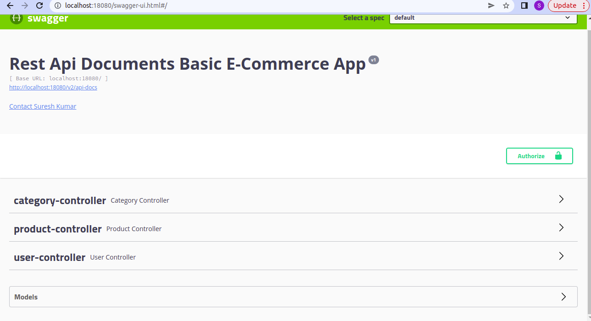
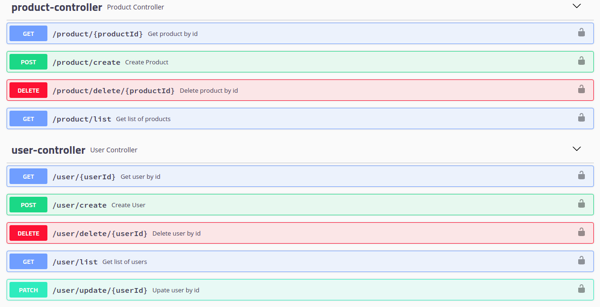

# basic-ecommerce
Rest api for basic ecommerce actions

List of Tech features used for this projects are: 

<ul>
<li>Spring Boot</li>
<li>Spring Boot Data Jpa</li>
<li>Spring Boot Validations</li>
<li>Swagger</li>
<li>Mapstruct</li>
<li>Basic Auth</li>
<li>Method Level Security</li>
<li>Central Exception Handler</li>
<li>Custom Validation Annotation Creations</li>
<li>Custom Method Security Expressions</li>
</ul>

Action Available in project 

<ul>
<li>One can create User(Role{ADMIN or USER})</li>
<li>Get User</li>
<li>Get User List</li>
<li>Delete User</li>
<li>Edit User</li>
<li>Create Product</li>
<li>Get Product</li>
<li>Get Product List</li>
<li>Delete Product</li>
</ul>

Default Users

<table style="border: 1px solid;">
<tr style="border: 1px solid;">
<td>admin</td>
<td>admin@123</td>
</tr>
<tr>
<td>user</td>
<td>user@123</td>
</tr>
</table>

Swagger

localhost:18080/swagger-ui.html

